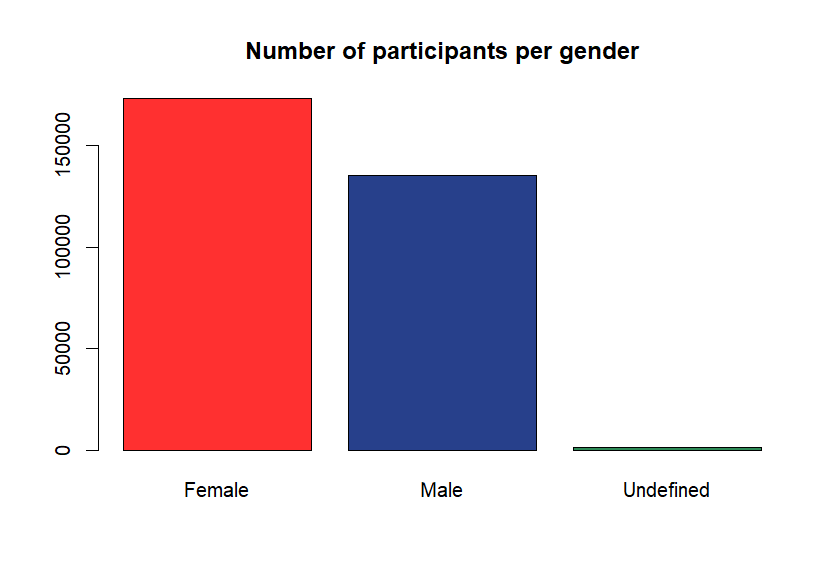

# Erasmus EU Mobility
Dataset exploration of the Tidy Tuesday dataset available at https://github.com/rfordatascience/tidytuesday/blob/master/data/2022/2022-03-08/readme.md
Analysis done using R

# Understanding dataset and variables
First of all, each row of the dataset may correspond to more than one participant.
The variable _participants_ gives the number of participants for which row.
We have 309751 participants for 164635 rows, and 24 variables in total.

Secondly, this dataset doesn't cover the entire Erasmus program, which probably explains many oddities described later on. We can gather from the following investigations that they are all learners involved in a Youth Erasmus program.

By taking a look at the variable *project_reference*, we notice that all projects found in the dataset belong to the category "KA347".
I am not familiar at all with what this refers to, but the Tidy Tuesday description of variables states that higher education is associated with KA103 and KA107.
 
Moreover, inspecting the variable *activity_mob* reveals that most projects **add data and graph** belong to two groups : the National youth meetings and the Transnational youth meetings, with a single project associated with the Youth Exchanges - Programme Countries.
 
Finally, The participants involved are all learners, and not staff, as indicated by the variable *participant_profile*.

Some variables such as *education_level* and *field_of_education* contain an unknown value (not missing value) for every single row and are thus do not reveal any useful information here.

# Exploration of variables
## Age

